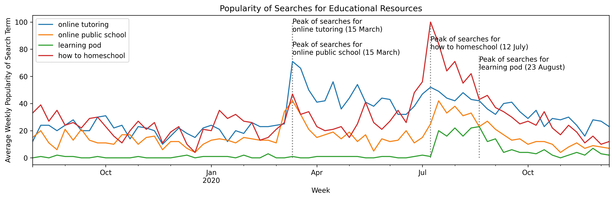
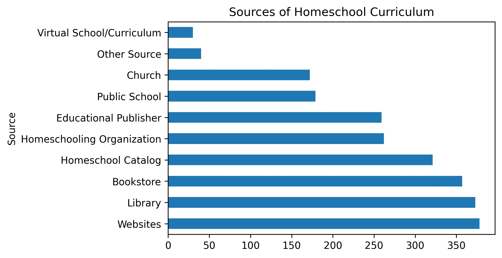
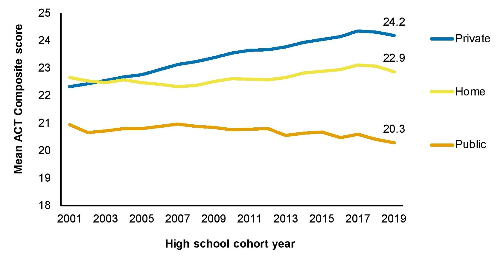

# Education and Parental Involvement during COVID-19: What happens when you take your child's education in your own hands?
**By Andrea Heyward**

**December 23, 2020**

In a regular, pre-pandemic workweek, parents had to eek out time for active engagement with their children between lengthy commutes, long work hours, household errands, and all the other responsibilities of raising a family. Ultimately, these demands left parents with little time for building strong relationships with their kids. In 2019, the [American Time Use Survey](https://www.bls.gov/charts/american-time-use/activity-by-parent.htm) found that--depending on the child's age--parents spent less than 2.3 hours a day on average actively caring for and helping their children. 

However, in a year when many are working from home or unemployed due to COVID-19, parents are now able to spend more time with their children. In some cases, the pandemic has allowed parents to learn more about and better connect with their children, hear their perspectives, and take an active role in their education. Will the bonds built between a child and parent during quarantine have a positive effect on the child's life later on? Measuring the impact of parental engagement before COVID could help inform a prediction on the matter.

Prior to the pandemic, how involved were parents in their children's lives, and what were the effects of greater involvement? By examining international data from the  Organisation for Economic Co-operation and Development (OECD), one can get a better sense of how spending more time with your child can affect them.

## Parental Involvement in OECD Countries

In 2015, the OECD gathered extensive data related to the [well-being of children](http://www.oecd.org/els/family/child-well-being/data/) within its member countries, including the percentage of adolescents (defined here as 15 year-olds) who felt that their parents were "interested in and supportive of their education." Of adolescents from all OECD member countries, Portugal had the highest percentage of teens (95.4%) express that they had academic support from their parents, whereas Turkey had the lowest percentage of teens (75.2%) feel the same. In all OECD countries, an average of 90.4% of teens reported that their parents were interested in their educational development. Such high proportions show that parents in OECD member countries generally value education.

Of course, being a "supportive" parent does not end at motivating one's child in school. A large part of being involved includes spending quality time with your child, simply talking with them to gauge their daily emotional and physical needs. An average of 95% of adolescents in OECD countries reported "talking to their parents before or after school." Iceland had the highest percentage of adolescents report this at 98.5%, and again, Turkey had the lowest percentage at 88.5%.

An important question, then, is whether involved parenting in OECD member countries has lead to better academic performance. The [Program for International Student Assessment (PISA)](http://www.oecd.org/pisa/pisafaq/) evaluates the reading, math, and science skills of 15-year-old students around the world. When scores from the 2015 PISA and parental involvement are compared, you see that standardized test scores for an OECD country increase with (but is not necessarily caused by) more parental involvement. 

In the figure below, each dot represents an OECD member nation. When a dot is further to the right, it means a country has a higher percentage of adolescents who report either a) their parents support their education or b) they speak with their parents both before and after school. When a dot is _higher_ on the graph, it means the average PISA score for that country is higher. The blue line in the center of the graphs slope upward, showing that when the percentage of teens with involved parents increases, a country's average PISA score also increases.

<figure class="text-center small">
    
   
   <figcaption>Chart by A.Heyward; Source: 2015 data from the  <a href="http://www.oecd.org/pisa/pisafaq/">Program for International Student Assessment (PISA)</a> </figcaption>
</figure>

Given that academic performance is positively correlated with involved parenting, parents could help put their child on the path to success by providing them with educational resources to assist their development. Because so many schools had to resort to non-traditional teaching methods during the pandemic, it is even more critical that parents help their students stay on track. How are parents taking an active role in their children's education in the absence of in-person instruction?

## Parents Are Seeking Educational Resources during the COVID-19 Pandemic

Many students had trouble making the transition to online learning. Parents had to brainstorm how to help their children maintain good grades in unexpected circumstances, and there were a number of resources to choose from. They could turn to online private tutors and tutoring programs, a time-tested method for academic improvement. Online public school programs like _[K-12](https://www.k12.com/online-public-schools.html)_ and _[Connections Academy](https://www.connectionsacademy.com/)_ were also an option; firmly-established online schools were better organized and equipped to handle online learning, whereas most public schools needed time to get familiar with the new format. To recover the social aspect of school, people started establishing ["learning pods,"](https://www.nytimes.com/article/learning-pods-coronavirus.html) small groups of students taught in person by a parent or private tutor. Or since many parents were already working from home, they may have decided to teach their children themselves. In the past year, what have parents searched on Google to help supplement their child's online schooling? 

The graph below measures the popularity of Google searches in the United States in a $1^{1/2}$ year period. As the [Google Trends site](https://trends.google.com/trends/explore?date=2019-08-01%202020-12-18&geo=US&q=online%20tutoring,online%20public%20schools,learning%20pod,how%20to%20homeschool) explains:

>"A value of 100 is the peak popularity of the term, while a value of 50 means that the term is half as popular." 

This graph shows search popularity for the terms "online tutoring," "online public school," "learning pods," and "how to homeschool" from August 1, 2019 (just before the last "normal" semester: Fall of 2019) and December 18, 2020 (the end of the most recent semester). 

<figure class="text-center small">
    
    <figcaption>Source: <a href="https://trends.google.com/trends/explore?date=2019-08-01%202020-12-18&geo=US&q=online%20tutoring,online%20public%20schools,learning%20pod,how%20to%20homeschool">Google Trends data for August 1, 2019 to December 18, 2020</a></figcaption>
    </figure>

**Trends in Fall 2019  Semester:**
As you can see, interest in online public school programs (represented as the yellow line) and online tutoring (the blue line) was relatively low. In 2019, a good amount of people searched "how to homeschool" (red line) before classes started in the fall, but interest tapered off once the school year was underway, and too few people back then knew about learning pods (green line) to search Google for them. However, these trends changed dramatically in March 2020, the point when many schools began closing their doors due to the virus' spread. 

**Trends in 2020 Semesters:**
By mid-March, searches for "online tutoring," "online public school," and "how to homeschool" showed a sharp increase, and searches for online tutors experienced sustained popularity for the rest of Spring 2020. These terms saw renewed interest in early July and throughout August in preparation for the Fall 2020 semester, and people also began searching for more information about "learning pods." Most interestingly, however, the searches for "how to homeschool" reached peak popularity during the week of July 12. Even though it seems parents consider homeschooling just before the start of every school year, many more people gave thought to it during the pandemic. It may be likely that children have been having a difficult time adjusting to online learning, and parents have decided to take matters into their own hands. 

Since interest in homeschooling increased significantly this year, it would be relevant to look at the way people have homeschooled their children prior to the pandemic.

## Popular Homeschooling Methods

In 2016, the National Center for Education Statistics (NCES) conducted its [National Household Education Survey (NHES)](https://nces.ed.gov/nhes/). They surveyed the parents of 14,075 children. 552 of the children were homeschooled. Whereas public school children typically spend 35 hours per week in class, the children in the survey were homeschooled each week for 4.8 days (about 5 days per week) for an average total of 22 hours. While most parents did not take a course to help them learn how to best homeschool their child, 76.4% of them had some sort of post-secondary education, whether it be technical, undergraduate, graduate, or professional schooling.

There are many ways to find the perfect homeschool curriculum. Parents often followed lesson plans from more than one source, but the most popular sources for homeschool lessons were websites, libraries, and bookstores. 

<figure class="text-center small">
    
   
   <figcaption>Chart by A.Heyward; Source: 2016 data from "Parent and Family Involvement in Education" section of the <a href="https://nces.ed.gov/nhes/">National Household Education Survey (2016)</a> conducted by the National Center for Education Statistics (NCES) </figcaption>
</figure>

Once parents picked their lessons from a diverse array of sources, a majority of them strictly followed methods for formal learning, using traditional teaching styles as opposed to [informal learning](https://infed.org/mobi/informal-learning-home-education-and-homeschooling-home-schooling/) that centers on the child's interests. In fact, 82.4% of parents used formal teaching as opposed to informal learning. 

It is obvious that homeschooling requires a great deal of dedication, time, and resources. But what are the benefits of choosing this education method over another? Does homeschooling give students an edge in their studies?

## The Effects of Homeschooling on Standardized Testing

The [American College Test (ACT)](https://www.act.org/content/act/en/products-and-services/the-act/help.html) is a national college admissions exam that measures a high school student's "academic readiness for college." Students are tested in reading, English, math, and science and given a score for each test from 1 to 36. Each test score is then averaged into what is known as a "composite score." The ACT research division found that "between 2001 and 2019, the number of homeschooled students [who took the ACT increased 178%](https://www.act.org/content/dam/act/unsecured/documents/R1832-ACT-homeschool-tested-2020-06.pdf)." How do the composite scores of homeschooled teens compare to those who attend public or private school? Below is a graph showing the average composite ACT scores for each graduating class from 2001 to 2019.

<figure class="text-center small">
    
   
   <figcaption>Source: <a href="https://www.act.org/content/dam/act/unsecured/documents/R1831-act-homeschool-stats-2020-08.pdf">2020 publication by Dr. Jeff Allen and Dr. J. Scott Payne</a>, statisticians in the <a href="https://www.act.org/content/act/en/research.html">Research division at American College Test (ACT)</a> </figcaption>
</figure>

In those 18 years, the lowest average ACT score for homeschooled students was 22.3 in 2007, and the highest score was 22.7 in 2013. Graduating homeschool students (represented as the yellow line) consistently performed better on average than public school seniors (orange line). Homeschool students always scored at least 1.4 points higher on average than high school seniors in public school. On the other hand, the average composite score for private school students (blue line) rose to surpass those of homeschooled students in 2003, and it remained on an upward trend until scores for public, private, and homeschooled seniors declined in 2017. So while homeschooling did not yield the best test scores out of all three schooling methods, one could say it's a step above public schooling. 

The findings above demonstrate the possible long-term implications of parents investing more in their child's education, both during the pandemic and beyond. This quarantine period (trying, though it may be) could have a positive effect on a child's academic performance if parents have the time and resources to devote to extra academic help. However, it is very important to note that not every child will come out of this pandemic with better grades just because they were at home with their parents; it is unlikely that low-income households will see trends of similar magnitude due to lack of resources. Although the learning gap is set to widen because of the pivot to online learning, more involved parenting (whether in the form of quality time, academic help, or even homeschooling) may help students tread water until they can safely go back to school.
